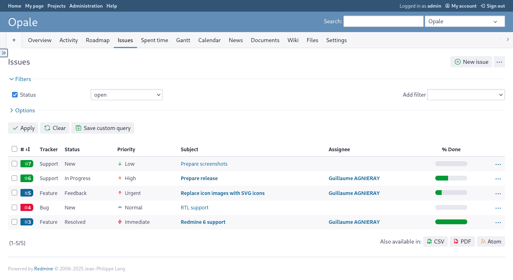

Opale
=====

A Redmine 6.x theme.

[](https://www.gnu.org/licenses/agpl-3.0)
[](https://github.com/gagnieray/opale/actions/workflows/lint.yml)
[](https://github.com/stylelint-scss/stylelint-config-standard-scss)
[](https://github.com/cahamilton/stylelint-config-property-sort-order-smacss)

---



## Main features

* Left sidebar,
* Colored trackers links,
* Jira-inspired priority icons,
* Customizable with SCSS.

## Releases

* **Redmine 6.x** : use either the latest stable release ([1.6.4](https://github.com/gagnieray/opale/archive/refs/tags/1.6.4.zip)), or use the `redmine-6.x` branch of this repository.
* **Redmine 5.x** : use either the latest stable release ([1.5.2](https://github.com/gagnieray/opale/archive/refs/tags/1.5.2.zip)), or use the `redmine-5.x` branch of this repository.

## Install

To install this theme :

1. [download the lastest stable release](https://github.com/gagnieray/opale/archive/refs/tags/1.6.4.zip) and decompress the archive to your Redmine's `themes` folder,
2. rename the folder `opale-1.6.4` to `opale`,
3. go to `Redmine > Administration > Settings > Display`, select `Opale` from the theme's list and save the settings.

## Customize

If you want to customize Opale to your needs, first, make sure that you have installed [Node.js](https://nodejs.org/) and `npm` is available in your terminal.

Then, from the directory that contains Opale run:

```bash
npm install
```

> [!WARNING]
> In production, never include the `node_module` folder created by this command. Otherwise, if present, it could cause a timeout during assets precompilation.

Now all the dependencies should be ready to use. Run one more command:

```bash
npm run watch
```

And now the grunt is watching for changes in files placed in `src/` folder.

Just change what you need, and it'll run Sass preprocessor automatically.

> [!TIP]
> Instead of using the `npm run watch` command, you can alternatively run the `npm run lint` and `npm run build` commands as needed to lint and build your code.
>
> In any case, thanks to [Husky](https://typicode.github.io/husky/), all your changes should be linted and built automatically with each commit.

> [!IMPORTANT]
> If you are customizing Opale in a production environment, to view your changes in Redmine 6.x, you will need to run the command `bundle exec rake assets:precompile RAILS_ENV=production` or restart your server.

Regrettably, optional file include is not possible in Sass, so I would recommend creating a new file, e.g. `src/sass/_custom-variables.scss` and importing it at the beginning of `src/sass/application.scss` using the following at-use rule : `@use "custom-variables";`.

This way all the variables defined in `src/sass/_variables.scss` with the `!default` flag could be overridden in `src/sass/_custom-variables.scss`:

```scss
@use 'variables' with (
  $sidebar-position: right,
  $brand-primary: #614ba6
);
```

The path `src/sass/_custom-variables.scss` is added to `.gitignore` so it should make upgrading Opale with keeping your changes rather painless, given that the only thing you changed in Opale's source was adding this one line `@use "custom-variables";` at the beginning of `src/sass/application.scss`.

## Troubleshooting

**With Redmine 6.x, upon initial installation, depending on your server setup, it might occur that the theme appears to be broken because the assets were not loaded**

This happens because the assets of the theme have not been precompiled properly by Redmine.

Usually simply restarting the server should fix that.

If not, run the command `bundle exec rake assets:precompile RAILS_ENV=production`.

If deploying to a sub-uri, set the relative URL root as follows: `bundle exec rake assets:precompile RAILS_ENV=production RAILS_RELATIVE_URL_ROOT=/sub-uri`.

If you still experience issues with missing assets in the browser, try removing the public/assets directory before re-running the precompile: ̀`bundle exec rake assets:clobber RAILS_ENV=production`.

## About Redmine Backlogs plugin

This theme also features a new look for [Redmine Backlogs](https://github.com/maedadev/redmine_backlogs) plugin.

To install it, simply copy stylesheets from `opale/plugins/redmine_backlogs` and overwrite files in `{redmine}/plugins/redmine_backlogs/assets/stylesheets`.

Then restart Redmine.

## Contributing

[Bug reports](https://github.com/gagnieray/opale/issues) and [Pull requests](https://github.com/gagnieray/opale/pulls) are welcome.
Please [read more about contributing](./CONTRIBUTING.md).

## Authors

[Read more about the authors](./AUTHORS.md).

## Copying

Opale is licensed under the [Affero General Public License version 3](https://www.gnu.org/licenses/agpl-3.0), the text of which can be found in [LICENSE](./LICENSE), or any later version of the AGPL, unless otherwise noted.

Licensing of included components:

* Normalize.css : [MIT License](https://github.com/necolas/normalize.css/blob/master/LICENSE.md),
* Bootstrap Mixins : [MIT License](https://github.com/twbs/bootstrap/blob/main/LICENSE),
* Tabler Icons: [MIT License](https://github.com/tabler/tabler-icons/blob/main/LICENSE).

All unmodified files from these projects retain their original copyright and license notices: see the relevant individual source files in `src/sass/vendor/`
